# Busca em memória secundária

Quando o volume de dados não cabe na memória primária (ou, mesmo que caiba, não se quer ocupar tanto espaço, ou se quer que sobrevivam ao programa que os acessa), a busca por um dado envolve acessos à memória secundária. Esses acessos devem ser otimizados, porque são tipicamente bem mais demorados que acessos à memória primária.

A diferença de tempo de acesso a memória secundária em relação à primária depende das tecnologias envolvidas, mas podem ser dezenas de vezes a milhões de vezes mais demorado obter um dado que esteja na memória secundária em relação à obtê-lo se já estiver em memória primária. Além disso, como regra geral, o acesso a dados em posições próximas ou até consecutivas é mais rápido que o acesso em posições aleatórias, em qualquer tecnologia em uso atualmente.

Uma forma comum de se otimizar esse acesso é separando os dados em um arquivo (ou mais) e índices que aceleram o acesso a esses dados em outros. Dessa forma, a busca por um dado envolve uma chave, que é buscada no arquivo de índice. Essa busca fornece uma identificação ou posição no arquivo de dados onde se encontra o dado correspondente a essa chave.

Um arquivo de dados pode ter mais de um arquivo de índice, que o indexa por chaves diferentes. Por exemplo, um arquivo contendo o cadastro de pessoas poderia ser indexado por número de CPF ou por número de matrícula ou por cidade de nascimento etc.
As chaves são divididas em chaves primárias, com uma correspondência única entre uma chave e um registro de dados e chaves secundárias, em que uma chave pode corresponder a vários registros (como seria o caso da cidade de nascimento no exemplo anterior). É comum no caso de chaves secundárias, em vez de se colocar várias cópias de cada chave repetida no arquivo de índice, ter um arquivo intermediário com *buckets*, cada um armazenando vários links para os vários registros do arquivo de dados correspondenter a uma chave, e o índice indexande esses *buckets*.

Um arquivo de índice pode conter uma estrutura linear, mas o mais comum é ter uma estrutura mais complexa, para acelerar as buscas.
Exemplos são árvores e tabelas *hash*. As árvores B+ são um bom exemplo.

## Árvore B+

Uma árvore B+ é constituída de nós, que podem ser 'nó folha' ou 'nó intermediário'.
Todos os nós folha estão no mesmo nível. O nó raiz pode ser folha (caso em que é o único nó da árvore) ou intermediário.

Um nó intermediário tem um conjunto de até $N$ links e até $N-1$ chaves. Se o nó tem $k$ chaves ativas, tem $k+1$ links ativos. As chaves são mantidas em ordem crescente. O primeiro link ativo aponta para a subárvore contém valores menores que a primeira chave ativa, o segundo link aponta a subárvore que tem valores maiores que a primeira chave e menores que a segunda, etc, e o último link ativo aponta para a subárvore que contém valores maiores ou iguais à última chave ativa.

Pelo menos metade dos links de um nó intermediário devem estar ativos (por exemplo, se o nó tem capacidade para 11 links e 10 chaves, o nó deve possuir pelo menos 6 links e 5 chaves ativos; se tem capacidade para 10 links e 9 chaves, deve possuir pelo menos 5 links e 4 chaves ativos). Se for raiz, o limite mínimo é 1 chave e 2 links, independentemente da capacidade.

Um nó folha tem capacidade para $M$ chaves, que são mantidas em ordem crescente. A cada chave está associado um link, que referencia o dado relacionado a essa chave no arquivo de dados, ou a um *bucket* que referencia os vários dados relacionados, no caso de isso ser possível (como é comum com chaves secundárias).
É comum um nó folha possuir mais um link, para o nó folha que contém as chaves imediatamente sucedentes, para permitir o percurso do arquivo em ordem de chave sem a necessidade de buscas sucessivas.

Em um nó folha, pelo menos metade das chaves deve estar ativa (um nó onde cabem 11 chaves deve ter pelo menos 6 chaves ativas). Caso seja raiz, não tem ocupação mínima.

Tipicamente, um nó ocupa o máximo possível de um bloco de disco, para otimizar o tempo de E/S. Além das chaves e links, é necessário um pouco mais de informação no nó, como o seu tipo (folha ou intermediário), o número de chaves ativas, talvez o tamanho e o tipo de uma chave.
O o número de chaves em um nó é definido pelo tamanho dessa informação adicional, de uma chave, de um link, e do bloco. Por exemplo, se um bloco tem 4k bytes, a informação adicional tem 4 bytes, uma chave tem 30 bytes e um link tem 4 bytes, seria possível colocar 120 chaves no bloco ($4+120*30+121*4 = 4088$, sobram 8 bytes no bloco). É possível ter uma capacidade diferente em um nó folha em relação a um nó intermediário, porque o link para dados pode exigir um tamanho diferente de um link para nó, e/ou porque não se armazena a chave inteira em um nó intermediário (em alguns casos isso é possível, porque o valor em um nó intermediário só é comparado com "<" contra o valor da chave buscada).

### Busca

A busca por uma chave em uma árvore B+ inicia pelo nó raiz.
No nó corrente:
- se o nó for folha, busca-se uma chave igual à chave buscada entre as chaves desse nó. Se for encontrada, o link correspondente é o resultado da busca. Se não for encontrado, a chave não existe na árvore.
- se o nó for intermediário, compara-se a chave buscada ($c_b$) com os valores de chaves no nó (c_i), até achar a primeira em que ($c_b < c_i$) e segue-se para o nó correspondente ao link dessa chave ($l_i$). Se todas as chaves do nó forem menores que a buscada, segue-se para o nó do último link ativo. Por exemplo, se o nó contiver as chaves `G`, `K` e `P`, e a chave buscada for `J`, a segunda chave (`K`) é a primeira maior `J` (`J` < `K`), então continua-se no nó correspondente ao segundo link. Se a busca fosse pela chave `Q`, que não é menor que nenhuma das chaves do nó, o próximo nó seria o referenciado pelo último link ativo do nó (o quarto link).

### Inserção

A inserção é sempre realizada em um nó folha, o mesmo encontrado quando se faz a busca. Se esse nó tem espaço para mais uma chave, basta inserir essa chave e o link para o arquivo de dados que contém o dado correspondente e a inserção está feita.
Se o nó já está cheio, um novo nó deve ser alocado, e o conjunto de chaves é dividido entre os dois nós. O nó pai deve ser alterado para incluir um ponteiro para esse novo nó, juntamente com o valor de uma chave para se poder decidir entre os dois nós. Uma chave adequada é aquela que ficou no início do novo nó.

Essa inserção no nó pai pode provocar a necessidade de divisão desse nó, e isso pode acontecer em cascata até o nó raiz.
Abaixo está um sequência de inserções em uma árvore inicialmente vazia, que exemplifica esses casos. As chaves são caracteres, e são inseridos, em ordem, os caracteres `PMGVTAEBJKFHDICLRNUQOS`.

A árvore está inicialmente vazia. Com a inclusão de `P`, a raiz é transformada em um nó folha. As inclusões seguintes de `M` e `G` são colocadas no mesmo nó, reordenando a cada vez. Ao final temos a situação abaixo, com o nó cheio. Nesse desenho, os nós folha estão sendo representados sem os links para os registros de dados correspondentes às chaves, nem o link que interliga os nós folha.
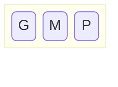
Com a inclusão de `V`, o nó estoura. Um novo nó folha é criado, e o total de dados é dividido assim: metade dos dados permanece no nó já existente (`G` e `M`) e o restante (`P` e `V`) é colocado no novo nó. O primeiro valor do novo nó (`P`), juntamente com a referência a esse novo nó é enviado para ser colocado no nó superior. Como o nó que foi quebrado é a raiz, não existe nó superior. É criado um novo nó intermediário, que passa a ser a nova raiz:
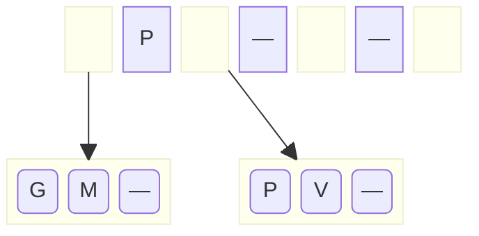
A inclusão de `T` enche o nó folha da direita, e a inclusão de `A` enche o nó folha da esquerda.
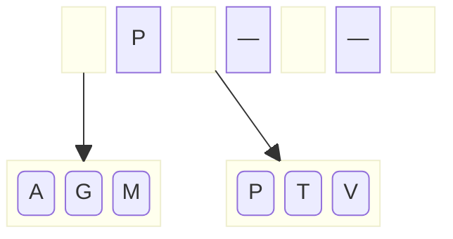
A inclusão de `E` causa o estouro da folha à esquerda e a criação de uma nova folha. Os valores envolvidos (`A`, `E`, `G` e `M`) são distribuídos como antes: metade na folha existente (`A` e `E`), o restante na nova (`G` e `M`). O primeiro valor da nova folha (`G`) e a referência ao novo nó são enviados para o nó acima (a raiz), que tem espaço para acomodá-los:
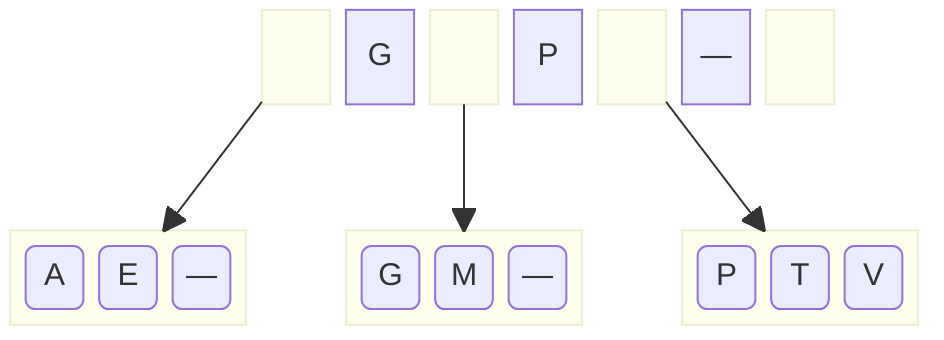
As inclusões de `B` e `J` enchem os nós folha da esquerda. A inclusão de `K` causa o estouro do nó folha com `G`, `J` e `M`, que fica com `G` e `J`, indo `K` e `M` para um novo nó, e subindo `K` e a referência ao novo nó para a raiz:
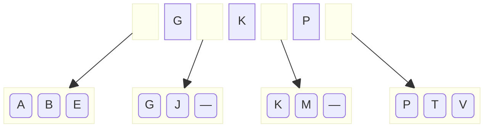
A inserção de `F` causa o estouro do nó `ABE`, que é quebrado em `AB` e `EF`, subindo `E` e um link para o novo nó. Não tem espaço no nó raiz para essa nova informação, e o nó raiz não tem irmão e tem que ser quebrado em dois nós intermediários. A quebra de nós intermediários é um pouco diferente, metade das chaves fica no nó esquerdo (`EG`); a chave seguinte (`K`) sobe junto com o link para o novo nó e as chaves restantes (`P`) vão para o novo nó.
Não existe nó acima (já que estamos quebrando a raiz), então a chave que sobe é acomodada em um novo nó raiz:
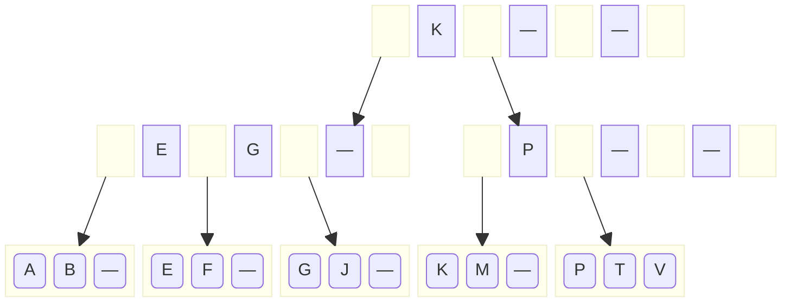
A inclusão de `H` e `D` enche os nós `ABD` e `GHJ`. A inclusão de `I` causa o estouro deste último e sua divisão em `GH` e `IJ`, subindo `I` para o nó `EG`, que vira `EGI`:
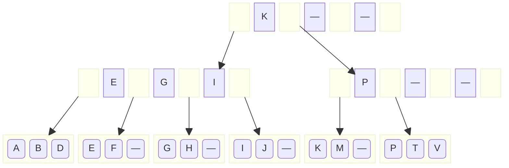
A inserção de `C` causa o estouro do nó `ABD`, que é dividido em `AB` e `CD`, subindo `C` e o link para o novo nó. Essa informação não cabe no nó acima (`EGI`). O nó acima tem um irmão (`P`) com espaço, então a informação dos nós é distribuída entre eles. Nessa redistribuição, deve-se considerar, além dos valores constantes nos dois nós que serão mesclados, também o valor da chave intermediária que está no nó pai (`K`). A redistribuição então é dos valores `CEGIKP`, em que o valor do meio (`G` ou `I`) sobe para o pai, os da esquerda ficam no nó da esquerda e os da direita no nó da direita. Subindo `I`, resulta na árvore abaixo.
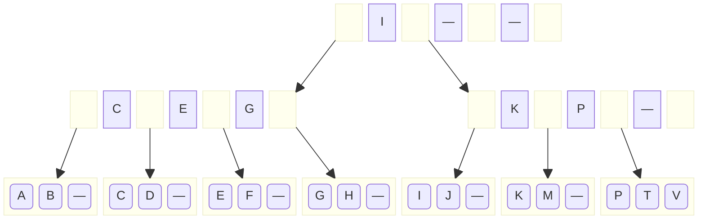
A inclusão de `LRNUQOS` fica como exercício. A árvore resultante está abaixo:

### Remoção

Na remoção, a chave deve ser encontrada em um nó folha (senão, não há nada a ser removido). A chave é então removida do nó folha e, caso o número de chaves restantes seja pelo menos o mínimo aceito para um nó folha, a remoção está feita.

Caso restem menos chaves que o permitido no nó folha, deve-se observar um nó vizinho irmão e:
- se as chaves nos dois nós forem suficientes para serem distribuídas entre os dois nós (de forma que ambos fiquem pelo menos com o mínimo permitido), é feito um remanejo;
- se o número de chaves for insuficiente, deve ser feita uma fusão.

No remanejo, as chaves são redistribuídas entre os nós, de forma a ficar aproximadamente metade em cada, e o nó pai é alterado para substituir o valor intermediário pelo valor que ficou no início do nó da direita. Após o remanejo, a remoção está completa.

Na fusão, as chaves do nó da direita são transferidas para o nó da esquerda, e o nó da direita é liberado. O ponteiro para o nó da direita e o valor correspondente a ele devem ser removidos do nó pai. Essa remoção no nó pai pode levar à necessidade de um remanejo ou fusão no nó pai. Todos os nós até a raiz podem ser afetados, e se a raiz ficar sem nenhuma chave, é removida e seu único filho se torna raiz.

O remanejo e fusão em um nó intermediário deve levar em consideração o valor contido no nó pai, entre os ponteiros para os dois nós envolvidos.

Considerando a árvore final do exemplo acima, se removermos a chave (`N`), ela será simplesmente removida do nó raiz que a contém, transformando `MNO` em `MO`.
Se após isso removermos `S`, o nó `RS` ficará somente com `R`, o que não é permitido para um nó folha. O irmão direito desse nó tem `TUV`, sendo possível remanejar, ficando `RT` no nó esquerdo e `UV` no direito. No nó pai, a chave `T` deve ser a lterada para `U`, resultando na árvore abaixo.
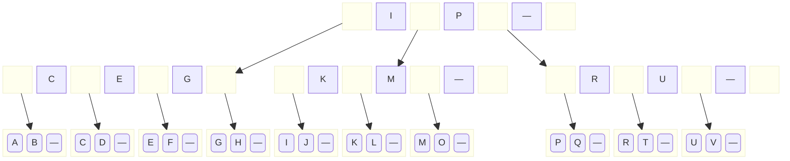
Se agora removermos o `Q`, o nó `PQ` ficará somente com `P`. Seu vizinho esquerdo não é irmão, e seu vizinho direito não tem chaves suficienter para remanejo, então será feita uma fusão entre `P` e `RT`, resultando em um nó com `PRT` e liberando o nó `RT`. O ponteiro para `RT` no nó pai deve ser removido, junto com a chave `R`. O nó pai fica só com a chave `U`, o que é permitido para um nó intermediário. A árvore fica:
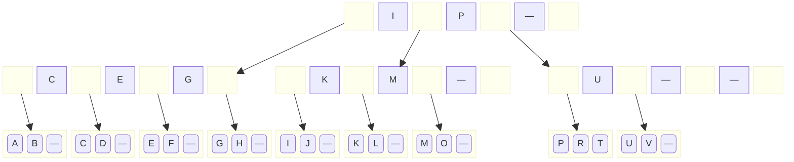
Nessa configuração, se removemos o `P`, ele é simplesmente retirado do nó, restando `RT`. Removendo então o `R`, o nó `T` deverá ser fundido ao nó `UV`, resultando em `TUV`. O nó que tinha `UV` é removido, e seu link e a chave `U` são removidos do seu pai, que fica sem chaves. Seu irmão esquerdo tem 2 chaves (`K` e `M`), então o remanejo pode ser feito. As chaves envolvidas no remanejo são `K`, `M` e `P` (que está no pai deles, a raiz). Fica `K` na esquerda, `P` na direita e `M` na raiz:
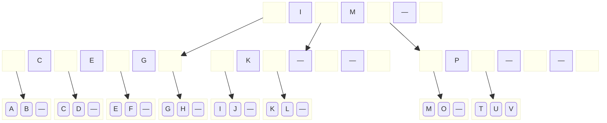
#### Exercícios

Faça as inserções que faltaram, e continue as remoções, sempre da maior chave, até esvaziar a árvore.
