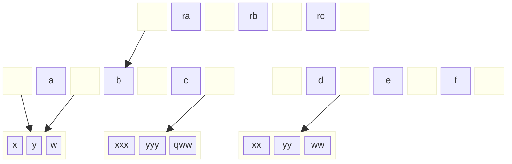

```mermaid
block
columns 15
space:4
block:rl1 space end ra block:rl2 space end rb block:rl3 space end rc block:rl4 space end
space:4
space:15
block:l1 space end a block:l2 space end b block:l3 space end c block:l4 space end
space
block:dl1 space end d block:dl2 space end e block:dl3 space end f block:dl4 space end
%%dl1(("+")) d:2 dl2(("+")) e["e"]:2 dl3(("+")) f:2 dl4(("+"))
space:15
block:z:2 x y w end
space
block:zzz:3 xxx yyy qww end
space
block:zz:3 xx yy ww end
rl1-->b
l1-->z
l4-->zzz
l2-->z
dl2-->zz
```
