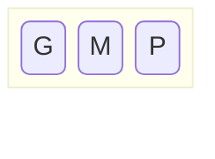
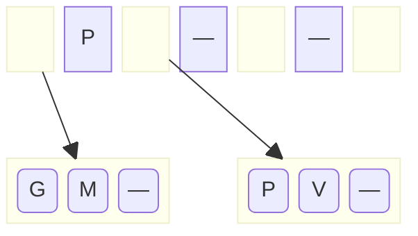
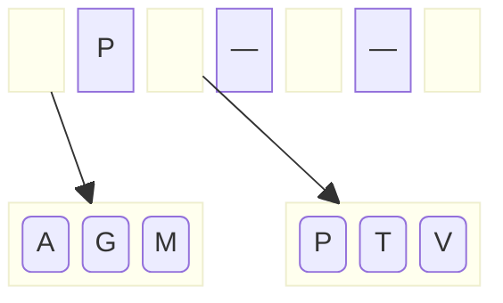
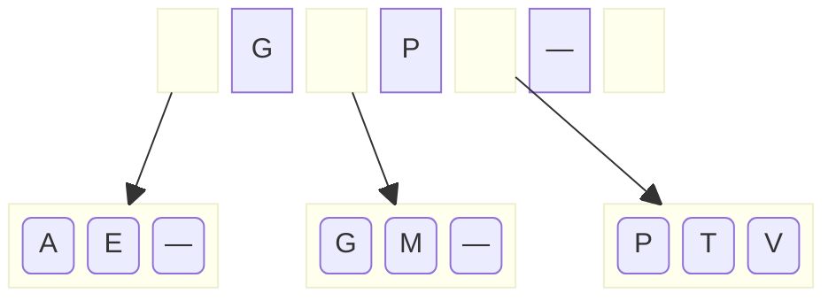
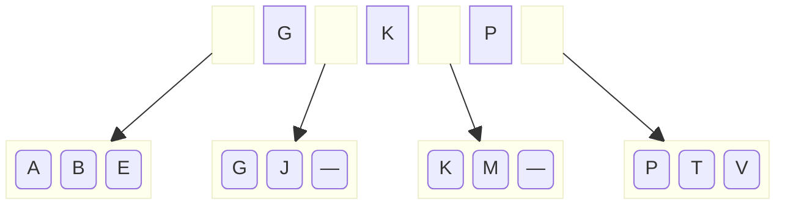
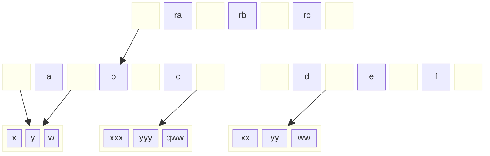

A árvore está inicialmente vazia. Com a inclusão de `P`, a raiz é transformada em um nó folha. As inclusões seguintes de `M` e `G` são colocadas no mesmo nó, reordenando a cada vez. Ao final temos a situação abaixo, com o nó cheio. Nesse desenho, os nós folha estão sendo representados sem os links para os registros de dados correspondentes às chaves, nem o link que interliga os nós folha.

Com a inclusão de `V`, o nó estoura. Um novo nó folha é criado, e o total de dados é dividido assim: metade dos dados permanece no nó já existente (`G` e `M`) e o restante (`P` e `V`) é colocado no novo nó. O primeiro valor do novo nó (`P`), juntamente com a referência a esse novo nó é enviado para ser colocado no nó superior. Como o nó que foi quebrado é a raiz, não existe nó superior. É criado um novo nó intermediário, que passa a ser a nova raiz:

A inclusão de `T` enche o nó folha da direita, e a inclusão de `A` enche o nó folha da esquerda.

A inclusão de `E` causa o estouro da folha à esquerda e a criação de uma nova folha. Os valores envolvidos (`A`, `E`, `G` e `M`) são distribuídos como antes: metade na folha existente (`A` e `E`), o restante na nova (`G` e `M`). O primeiro valor da nova folha (`G`) e a referência ao novo nó são enviados para o nó acima (a raiz), que tem espaço para acomodá-los:

As inclusões de `B` e `J` enchem os nós folha da esquerda. A inclusão de `K` causa o estouro do nó folha com `G`, `J` e `M`, que fica com `G` e `J`, indo `K` e `M` para um novo nó, e subindo `K` e a referência ao novo nó para a raiz:

* * *

