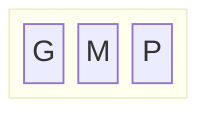
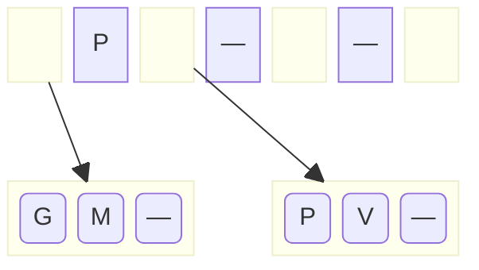
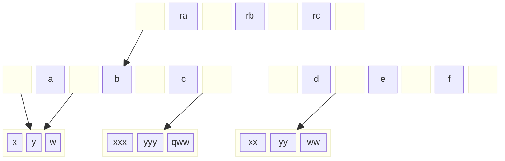

A árvore está inicialmente vazia. Com a inclusão de `P`, a raiz é transformada em um nó folha. As inclusões seguintes de `M` e `G` são colocadas no mesmo nó, reordenando a cada vez. Ao final temos a situação abaixo, com o nó cheio. Nesse desenho, os nós folha estão sendo representados sem os links para os registros de dados correspondentes às chaves, nem o link que interliga os nós folha.

Com a inclusão de `V`, o nó estoura, e não sem outro nó para onde enviar dados excedentes. Um novo nó folha é criado, e o total de dados é dividido assim: metade dos dados permanece no nó já existente e o restante é colocado no novo nó. O primeiro valor do novo nó, juntamente com a referência a esse novo nó é enviado para ser colocado no nó superior. Como o nó que foi quebrado é a raiz, não existe nó superior. É criado um novo nó intermediário, que passa a ser a nova raiz:

* * *

