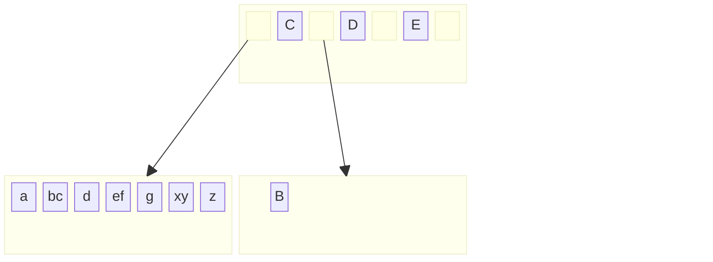

```mermaid
block
columns 30
  space:10
  block:r:10
  columns 10
  block:l1:1 space end
  C:2
  block:l2:1 space end
  D["D"]:2
  block:l3:1 space end
  E:2
  block:l4:1 space end
  end
  space:10
  space:30
  block:w:10
  columns 10
  a bc:2 d ef:2 g xy:2 z
  end
  block:x:10
  space B:2 space space:2 space space:2 space
  end
  l1-->w
  l2-->x
```
