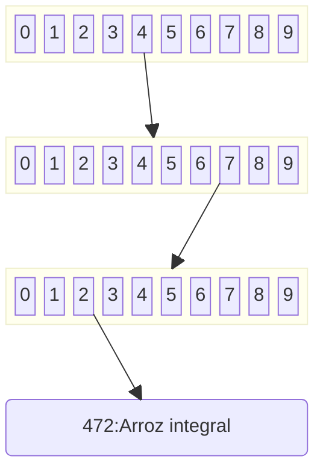
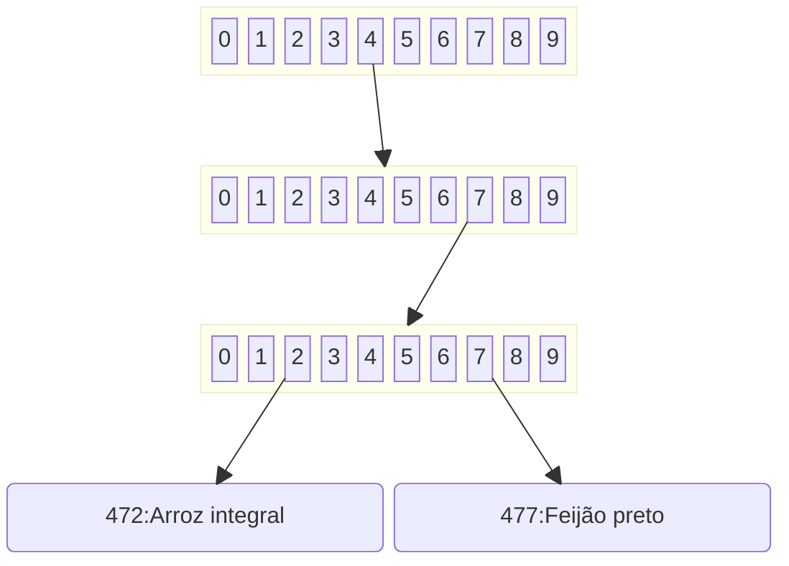
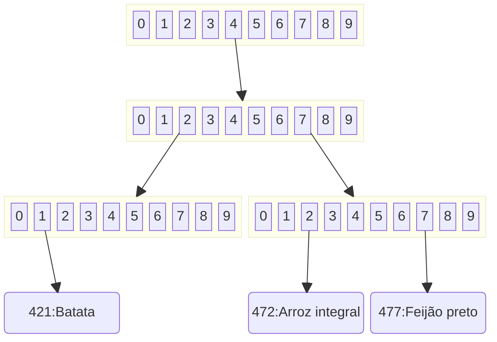
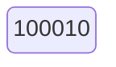
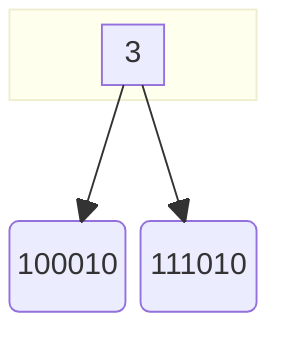
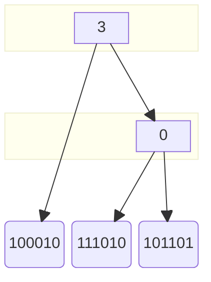
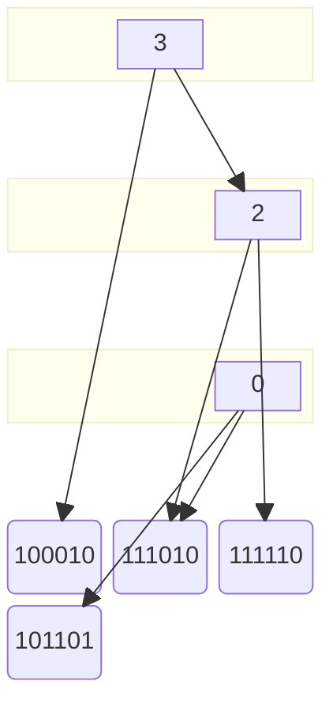

#### Árvore *trie*

O nome vem de *retrieve* (recuperar em inglês). É uma árvore de busca, em que de cada nó se decide qual o nó seguinte da busca a partir de uma parte da chave.
A chave é considerada como uma sequência de símbolos (pode ser um caractere, um dígito, certo número de bits, etc).
O valor de um símbolo pertence a um alfabeto (o conjunto de valores possíveis para um símbolo), e um nó da árvore tem um possível nó filho correspondente a cada valor possível do alfabeto.
Para realizar uma busca na árvore, inicia-se pela raiz e pelo primeiro símbolo. O nó seguinte é aquele que corresponde a esse símbolo na raiz. A busca continua pelo nó que corresponde ao segundo símbolo da chave no segundo nó e assim por diante, até que não exista nó correspondente ao símbolo (quando a chave não está na árvore) ou se chegue a um nó folha, que representa a chave (onde está o valor associado à chave, por exemplo).

Considere que a chave é numérica e que se escolha os dígitos da chave como símbolos.
O alfabeto são os 10 dígitos decimais. Cada nó da árvore tem 10 nós destinos, um para cada símbolo possível.
A figura abaixo representa uma trie onde foi incluída a chave "472" associada ao dado "Arroz integral".

Adicionando o dado "Feijão preto" com chave "477", a árvore ficaria assim:

Adicionando "Batata" com chave "421", temos:

Nesse tipo de árvore, não é possível colocar chaves em que uma chave seja prefixo de outra. Na árvore acima, não dá para inserir um dado com chave "47" por exemplo.
Se for o caso de se possuir chaves com essa característica, adiciona-se um símbolo ao alfabeto, para representar o final de uma chave. Por exemplo, poderíamos acrescentar o símbolo "." ao alfabeto, passando todos os nós da árvore a conter 11 ponteiros, e as chaves passam a ser adicionadas desse caractere no final. A chave "47" poderia ser então incluída, como "47.".

Em uma trie, o tempo de busca independe do número de elementos na árvore, mas sim do número de símbolos na chave, que em geral é bem menor.
A grande desvantagem dessa estrutura é o espaço ocupado, porque os nós são grandes, com um ponteiro para cada símbolo possível, e a maior parte desses ponteiros não são utilizados (a maior parte dos nós, principalmente os que estão mais baixo na árvore, têm poucos de seus ponteiros apontando para um outro nó da árvore).
Para reduzir esse espaço, usa-se de algumas estratégias para compactar a trie.

Uma possibilidade é remover os nós que só tem um link válido. Em alguns casos, armazena-se no link os símbolos que ele representa. Por exemplo, na árvore acima poderia ser incluída a chave "123", com um link na raíz apontando diretamente do "1" para o nó folha, o link com a informação "23". Pode-se também não colocar o valor no link, mas uma informação no nó que diz a posição do caractere que deve ser usada para seguir no nó. Nesse caso, quando se chega em um nó folha, deve-se comparar a chave procurada com a chave da folha para ver se ela representa realmente a chave correta.

Uma outra possibilidade é só armazenar ponteiros que efetivamente apontem para algum nó, diminuindo o tamanho de cada nó. Junto a cada ponteiro deve-se identificar o símbolo ao qual ele se refere. Em geral, usa-se mais de um nó pequeno para implementar um nó da árvore original. No exemplo acima, o nó raiz só precisa uma ponteiro, para o símbolo "4".

Outra possibilidade ainda é reduzir o alfabeto, aumentando o número de símbolos em uma chave. No limite, o alfabeto pode ser binário, e a chave ser comparada bit a bit.
A árvore "patricia" é um exemplo de uma trie que usa os dois mecanismos de compactação da trie.

###### Árvore patricia

O nome vem de "Practical AlgoriThm foR Information Coded In Alphanumeric", e é uma trie binária, com supressão de nós que só teriam um ponteiro.
A chave é quebrada nos bits de sua representação binária, e cada bit é usado para escolher o caminho a seguir. Cada nó tem dois ponteiros, um para o bit 0 e outro para o bit 1. Além disso, tem um número que diz qual o bit que deve ser usado.
Com $n$ valores adicionados a uma patricia, a árvore conterá $n$ nós folha, um para cada chave e $n-1$ nós intermediários. A adição de um valor na árvore causa a inclusão de um nó folha e um nó intermediário.
Uma patrícia com só um valor tem somente um nó folha (que é também a raiz).
A sequencia abaixo mostra a evolução de uma patricia, inicialmente com o valor "100010".

Adicionando o valor "111010": a adição funciona como uma busca, até se chegar a um nó folha. Então verifica-se o bit mais à direita que é diferente entre a chave já existente e a chave que se está adicionando. Cria-se um nó folha para a nova chave e um nó para esse bit que diferencia as duas chaves. Os bits são numerados à partir de 0, à partir do menos significativo. No caso, o bit menos significativo que é diferente entre "100010" e "111010" é o bit 3, o quarto da direita para a esquerda. A árvore ficaria assim:

Adicionando agora o valor "101101", inicia-se a busca pela raiz, que diz que se deve olhar o bit 3 da chave. Esse bit tem o valor "1", então segue-se pela direita, encontrando o nó folha com o valor "111010". O primeiro bit diferente entre essas chaves é o bit 0, então a árvore fica:

Se nessa árvore incluirmos o nó "111110", na busca chegamos à folha com "111010". O bit menos significativo que os diferencia é o bit 2. Para inserir o novo nó intermediário (com o valor 2), devemos subir na árvore até encontrar um nó com valor maior, e inserir logo abaixo dele:

