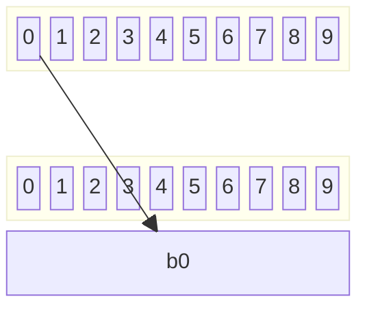

#### Árvore *trie*

O nome vem de *retrieve* (recuperar em inglês). É uma árvore de busca, em que de cada nó se decide qual o nó seguinte da busca a partir de uma parte da chave.
A chave é considerada como uma sequência de símbolos (pode ser um caractere, um dígito, certo número de bits, etc).
O valor de um símbolo pertence a um alfabeto (o conjunto de valores possíveis para um símbolo), e um nó da árvore tem um possível nó filho correspondente a cada valor possível do alfabeto.
Para realizar uma busca na árvore, inicia-se pela raiz e pelo primeiro símbolo. O nó seguinte é aquele que corresponde a esse símbolo na raiz. A busca continua pelo nó que corresponde ao segundo símbolo da chave no segundo nó e assim por diante, até que não exista nó correspondente ao símbolo (quando a chave não está na árvore) ou se chegue a um nó folha, que representa a chave (onde está o valor associado à chave, por exemplo).

Considere que a chave é numérica e que se escolha os dígitos da chave como símbolos.
O alfabeto são os 10 dígitos decimais. Cada nó da árvore tem 10 nós destinos, um para cada símbolo possível.

