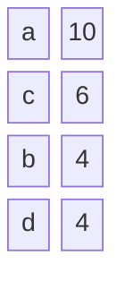
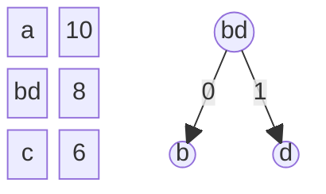
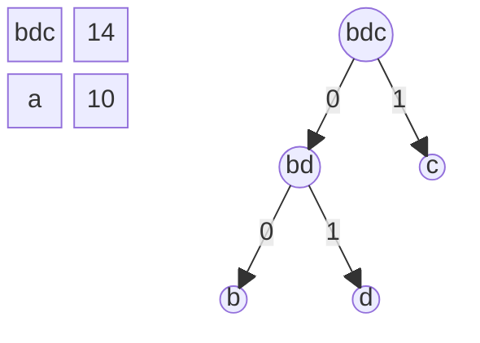
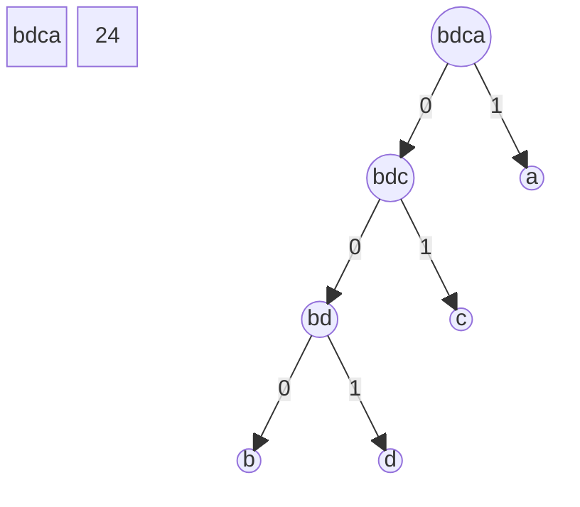
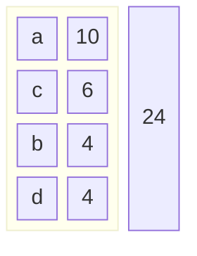
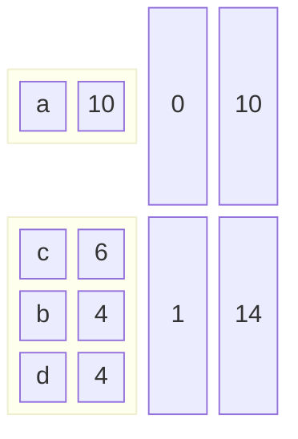

# Compressão de dados

Dados necessitam espaço. Isso implica:
- custo em memória principal;
- custo em dispositivos de armazenamento;
- custo em tempo de transferência;
- custo em tempo de processamento.

Comprimir os dados pode significar redução nesses custos.
A compressão pode ser baseada em se remover redundância inerente aos dados ou à forma como eles são codificados.
Pode também ser baseada em limitações na forma que esses dados serão processados, que por vezes não tem capacidade de lidar com todo o nível de detalhe codificado nos dados brutos.

A compressão envolve a codificação dos dados, que transforma a representação original dos dados em uma forma comprimida que, espera-se, ocupe menos espaço. Essa representação geralmente não é usável diretamente, e os dados comprimidos precisam ser decodificados antes de serem usados novamente.

Existem duas grandes "famílias" de algoritmos de compressão
- sem perda, em que os dados depois de codificados e decodificados são idênticos aos originais;
- com perda, em que pode haver diferenças entre os dados originais e aqueles obtidos após a codificação e decodificação.

Os algoritmos com perda obtêm em geral um grau de compressão bem maior que os algoritmos sem perda (e é por isso que existem). Seu uso mais comum é na codificação de áudio e vídeo destinado ao consumo final — são comprimidos para serem armazenados e/ou transmitidos de forma mais barata, e são descomprimidos para serem imediatamente apresentados, esperando que as diferenças em relação à informação original sejam pouco percebidas.

Por exemplo, um arquivo que representa um áudio de qualidade CD não comprimido usa 1.4 Mbit/s, um bom compressor sem perdas como FLAC diminui para uns 700kbit/s (taxa de compressão 2), um compressor como MP3 para 140kbit/s (10) com perdas imperceptíveis pela maioria das pessoas ou para 70 kbit/s (20) com perdas consideradas aceitáveis pela maioria.

Nos concentraremos nos algoritmos sem perda. Inicialmente com algumas ideias simples, depois métodos estatísticos, que se baseiam na frequência que os valores ocorrem nos dados não comprimidos e métodos de dicionário, que usam codificam sequências mais longas de dados.

## Métodos básicos

### Run length encoding (RLE)

Codifica sequências longas de dados de mesmo valor, que são comuns em alguns tipos de dados, particularmente em desenhos com pequeno número de cores.
Em vez de armazenar a sequência (*run*) de valores iguais, armazena-se o comprimento (*length*) e o valor.
Esse método só atinge um grau razoável de compressão em dados que contenham um número relativamente grande dessas sequências.

Por exemplo, a sequência `AAAAABBBCCCCCCCCAAACBB` poderia ser codificada `5A3B8C3A1C2B`, passando de 22 para 12 caracteres. Usando essa mesma codificação, a sequência `ABBCD` seria codificada `1A2B1C1D`, passando de 5 para 8 caracteres.

Tem formas de evitar colocar repetição quando for 1 só valor. Por exemplo, usando um caractere especial (não usado ou pouco usado no arquivo fonte, como `#`) para informar o valor, codificando `ABBBBCDDDDDAF` como `A#4BC#5DAF` em vez de `1A4B1C5D1A1F`, ou dobrar o caractere (codificando o exemplo anterior como `ABB4CDD5AF`). O número de repetições pode ser codificado em binário para permitir codificar comprimentos maiores.

O formato "PackBits" usado entre outros como uma das formas de compressão de imagens no formato "TIFF" usa RLE, codificado como sequências de pacotes, onde o primeiro byte de pacote, interpretado como um número $n$ com sinal pode ser um número positivo, caso em que ele é seguido por $1+n$ bytes literais (que são iguais ao arquivo de entrada), ou um número negativo, case em que ele é seguido por $1$ byte, que deve ser repetido $1-n$ vezes.

### Mapa de bits

Em casos em que os dados contêm um valor que se sobressai enormemente dos demais, o uso de um mapa de bits pode reduzir o espaço necessário para codificar esses dados. Para codificar um grupo de 8 bytes de dados, inicia-se por um byte que usa um bit para cada um desses bytes, tendo o valor 1 se o byte tiver o valor especial e 0 se tiver outro valor. Os valores diferentes seguem esse primeiro byte.
Por exemplo, para codificar `ABAAACBA`, sendo `A` o valor especial, o primeiro byte tem o valor binário `10111001` e os demais bytes os valores `BCB`, codificando os 8 bytes em 4. Tendo uma sequência de 8 bytes sem o valor especial, codifica-se 8 bytes em 9, tornando a saída maior que a entrada. Tendo 1 dos 8 bytes com o valor especial, os 8 bytes seriam codificados em 8 bytes, e tendo 2 ou mais bytes com o valor especial no grupo de 8 bytes, tem-se um ganho na compressão. Pode ter um desempenho um pouco melhor que RLE para dados excepcionalmente adequados, mas em geral é pior.

### Compressão de 1/2 byte

Essa forma de compressão baseia-se na forma como os códigos dos caracteres são distribuídos na tabela ASCII, em especial os que representam os dígitos. Em alguns tipos de dados, tem-se uma sequência de caracteres em que todos têm o mesmo prefixo, com os primeiros 4 bits iguais (os dígitos, por exemplo, começam todos com `0011`). Esta compressão usa 2 bytes para dizer que os dados seguintes contém duas metades de byte em cada byte. Só comprime sequências de 6 ou mais bytes seguidos que compartilhem o mesmo prefixo. O arquivo comprimido é igual ao original, até que seja encontrada uma tal sequência, então é codificado um byte com um valor especial, seguido de um byte em que 4 bits codificam o número de bytes sendo comprimidos e 4 contendo o prefixo comum desses bytes, seguido de bytes contendo cada um 2 sufixos dos bytes comprimidos. Por exemplo, a string `balacas153492` em ASCII binário é
```
0110.0010 0110.0001 0110.1100 0110.0001 0110.0011 0110.0001 0111.0011 0011.0001 0011.0101 0011.0011 0011.0100 0011.1001 0011.0010
```
Os primeiros 6 bytes têm o mesmo prefixo `0110`, e os últimos 6 bytes têm o prefixo `0011`. A codificação seria (considerando que o byte de início de bloco comprimido seja `0000.0000`):
```
início    r=6  pref    b    a    l    a    c    a     s     início    r=6  pref    1    5    3    4    9    2
0000.0000 0110.0110 0010.0001 1100.0001 0011.0001 0111.0011 0000.0000 0110.0011 0001.0101 0011.0100 1001.0010
```
Os 13 bytes originais foram comprimidos para 11! Não parece muito promissor...

### Representação não ASCII

Caso os dados usem um alfabeto reduzido (o número de caracteres diferentes seja pequeno), pode-se usar menos que 8 bits para representar cada caractere. Por exemplo, se os dados utilizarem entre 65 e 128 caracteres diferentes, pode-se usar 7 bits para representar cada caractere; se entre 33 e 64, cada caractere pode ser representado por 6 bits, etc.

## Métodos estatísticos

Dividindo-se os dados em caracteres de tamanho fixo (geralmente bytes), e analisando a frequência em que cada valor possível aparece, constata-se que geralmente essa frequência é bastante variável. Por exemplo, em um texto em português, espera-se que o valor que representa a letra "a" seja bem mais frequente que o que representa "w". A ideia destes métodos é medir essas frequências e usar menos bits para representar os valores mais frequentes e mais bits para os menos frequentes, esperando que o número maior de vezes que se codifica valores com menos bits compense com vantagem os valores que são codificados com mais bits um número menor de vezes.

Por exemplo, suponha que os dados a comprimir sejam sequências de 4 valores possíveis, representados por `a`, `b`, `c` e `d`. A sequência `aabcccbaadacabaccadddaab` contém 10 `a`, 4 `b`, 6 `c` e 4 `d`, totalizando 24 símbolos. Se usarmos 2 bits para cada símbolo, necessitamos 48 bits para codificar essa sequência. Se utilizarmos 1 bit para `a`, 2 para `c`, 3 para `b` e para `d`, a mesma sequência poderia ser codificada com 46 bits. Se fossem 15 `a`, 2 `b`, 6 `c` e 1 `d`, passaria de 48 para 36 bits. Quanto maior a diferença de frequência, maior o ganho. Por outro lado, se tivermos 6 símbolos de cada, necessitaríamos 54 bits.

Para se poder identificar os códigos em uma sequência de bits, um códigos não pode ser prefixo de outro. No exemplo acima, os códigos poderiam ser `0`, `10`, `110` e `111` ou `1`, `00`, `010` e `011`, mas não `0`, `01`, `100` e `111` (a sequência `0100100` poderia codificar `0 100 100` ou `01 0 0 100`).

### Codificação de Huffman

Nessa codificação, constrói-se uma árvore trie binária, em que os nós folhas representam os símbolos e o caminho desde a raiz até uma folha representa o valor binário usado para o símbolo nessa folha. Quanto menos frequente for o símbolo, mais profunda é sua posição na árvore, e maior o número de bits usado para representá-lo.

A árvore é construída a partir de uma tabela contendo, para cada símbolo, o número de vezes que ele aparece, ordenada por esse número.
Para o exemplo acima, `aabcccbaadacabaccadddaab`, a tabela seria:

A cada passo, remove-se as duas entradas mais baixas da tabela, cria-se um nó na árvore que é o pai dos nós que representam esses dois valores, e insere-se na tabela uma entrada que corresponde ao nó criado e tem como valor a soma dos dois valores retirados.
No exemplo, ficaria:

Após o segundo passo:

Após o terceiro e último passo:

Percorrendo a árvore, o código para `a` é `1`, o código para `b` é `000`, para `c` é `01` e para `d` é `001`.

### Codificação de Shannon-fano

Essa codificação usa uma forma diferente de obter os códigos para cada símbolo, à partir da mesma tabela.

A cada etapa, divide-se a tabela em duas partes, de forma que a soma dos valores em uma e outra parte seja próxima da metade.
Uma das metades da tabela é codificada com `0` e a outra com `1`. Prossegue-se dividindo cada (sub)tabela em duas partes, até que tenha um código em cada.

Na primeira divisão da tabela acima, poderia dividir em `a` com o valor 10 de um lado e `cbd` somando 14 do outro, ou em `ac` somando 16 e `bd` somando 8.
A primeira é mais próxima da metade:


